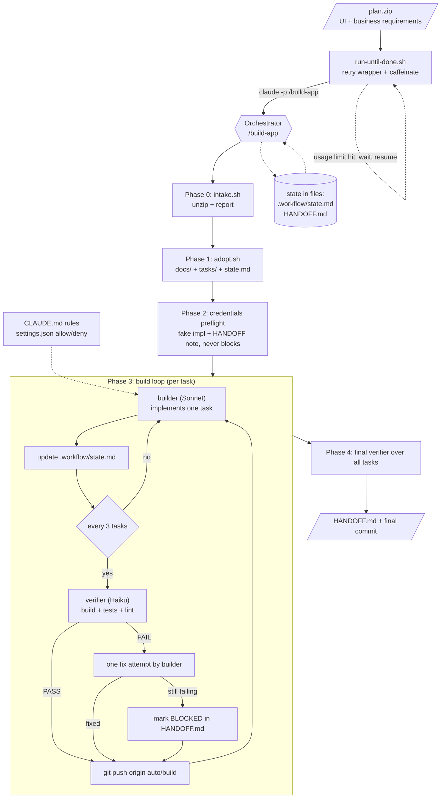

# Agentic build workflow

```mermaid
flowchart TD
    Z[/"plan.zip<br/>UI + business requirements"/] --> R["run-until-done.sh<br/>retry wrapper + caffeinate"]
    R -->|"claude -p /build-app"| O{{"Orchestrator<br/>/build-app"}}
    R -. "usage limit hit: wait, resume" .-> R

    O --> P0["Phase 0: intake.sh<br/>unzip + report"]
    P0 --> P1["Phase 1: adopt.sh<br/>docs/ + tasks/ + state.md"]
    P1 --> P2["Phase 2: credentials preflight<br/>fake impl + HANDOFF note, never blocks"]
    P2 --> L

    subgraph L["Phase 3: build loop (per task)"]
        direction TB
        B["builder (Sonnet)<br/>implements one task"] --> S["update .workflow/state.md"]
        S --> G{"every 3 tasks"}
        G -->|yes| V["verifier (Haiku)<br/>build + tests + lint"]
        G -->|no| B
        V -->|PASS| PU["git push origin auto/build"]
        V -->|FAIL| F["one fix attempt by builder"]
        F -->|still failing| BL["mark BLOCKED in HANDOFF.md"]
        F -->|fixed| PU
        BL --> PU
        PU --> B
    end

    L --> P4["Phase 4: final verifier over all tasks"]
    P4 --> H[/"HANDOFF.md + final commit"/]

    ST[("state in files:<br/>.workflow/state.md<br/>HANDOFF.md")] -.-> O
    O -.-> ST
    CL["CLAUDE.md rules<br/>settings.json allow/deny"] -.-> B
```
